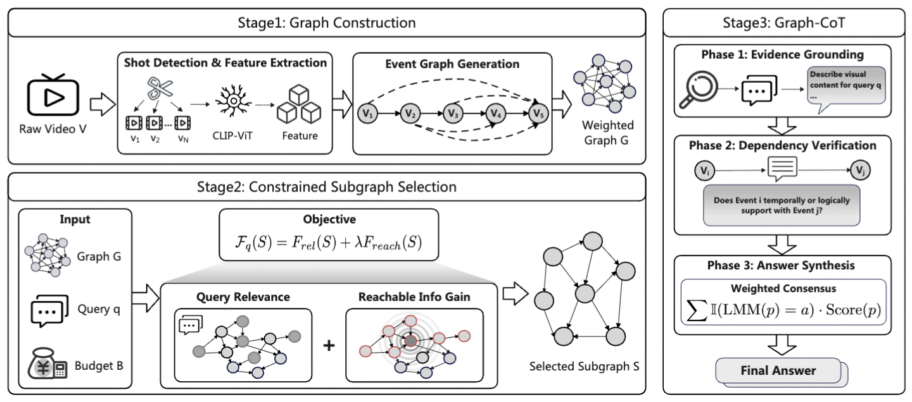

# EventGraph-LMM: Submodular Subgraph Selection for Token-Efficient Long-Video Understanding

<div align="center">

[]()
[]()
[]()

**EventGraph-LMM** is a **training-free** framework for long-video understanding. It reformulates video compression as a **constrained subgraph selection problem**, achieving SOTA performance on VideoMME, VRBench, and CinePile with minimal token usage.

[<a href="#-news">News</a>] • [<a href="#-abstract">Abstract</a>] • [<a href="#-framework">Framework</a>] • [<a href="#-performance">Performance</a>] • [<a href="#-installation">Installation</a>] • [<a href="#-usage">Usage</a>] • [<a href="#-citation">Citation</a>]

</div>

## 📖 Abstract

[cite_start]Understanding long-form videos with Large Multimodal Models (LMMs) is challenging due to massive visual token counts and limited context budgets[cite: 46]. [cite_start]We propose **EventGraph-LMM**, a training-free framework that reformulates long-video compression as a **constrained subgraph selection problem** rather than simple token pruning[cite: 47].

[cite_start]By modeling videos as directed event graphs that capture both temporal flow and long-range semantic dependencies, we formulate subgraph selection as a **monotone submodular maximization problem**[cite: 48]. [cite_start]This allows us to use the **CELF algorithm** to efficiently select the most informative frames with theoretical approximation guarantees[cite: 473]. [cite_start]Furthermore, we introduce a **Graph-Constrained Chain-of-Thought (Graph-CoT)** mechanism that guides the LMM's reasoning along verified visual dependencies, significantly reducing hallucinations[cite: 49].

---

## 🛠️ Framework

> **Figure 1**: The overall framework of EventGraph-LMM. We first decompose the video into events, construct a weighted graph capturing semantic and temporal links, and then select a budget-constrained subgraph to guide the LMM's reasoning.

<div align="center">
  
  <br>
  <em>(Please save Figure 2 from the paper as assets/framework.png)</em>
</div>

### Key Components

1.  **Event Graph Construction**: 
    * [cite_start]Decomposes video into events using **TransNetV2**[cite: 356].
    * [cite_start]Extracts global ([CLS]) and local patch features using **CLIP**[cite: 358].
    * [cite_start]Builds a graph $G=(V, E)$ with **temporal edges** (sequential flow) and **semantic edges** (long-range similarity)[cite: 360].
2.  **Constrained Subgraph Selection**: 
    * Solves the optimization problem: $\max_{S \subseteq V} \mathcal{F}_q(S) \text{ s.t. } |S| [cite_start]\leq k$[cite: 266].
    * [cite_start]The objective function $\mathcal{F}_q(S) = F_{rel}(S) + \lambda F_{reach}(S)$ balances **Query Relevance** and **Reachable Information Gain**[cite: 460].
    * [cite_start]Uses the **CELF algorithm** for fast, near-optimal selection[cite: 473].
3.  **Graph-Constrained Reasoning (Graph-CoT)**:
    * [cite_start]Guides the LMM to verify evidence and propagate logic strictly along the selected graph paths[cite: 482].

---

## 📊 Performance

We evaluate EventGraph-LMM on **VideoMME**, **VRBench**, and **CinePile**. [cite_start]Under a strict budget of **8,192 visual tokens**, our method significantly outperforms existing efficient inference baselines[cite: 582].

| Method | LLM Backbone | VideoMME | VRBench | CinePile | Avg. |
| :--- | :--- | :---: | :---: | :---: | :---: |
| **Full-Sequence (Upper Bound)** | Qwen2.5-VL-7B | 56.5 | 45.5 | 35.2 | 45.7 |
| | | | | | |
| FastV | Qwen2.5-VL-7B | 34.5 | 22.0 | 18.5 | 25.0 |
| DyCoke | Qwen2.5-VL-7B | 52.3 | 43.1 | 38.4 | 44.6 |
| Q-Frame | Qwen2.5-VL-7B | 51.8 | 47.2 | 37.1 | 45.4 |
| **EventGraph-LMM (Ours)** | **Qwen2.5-VL-7B** | **58.5** | **54.8** | **48.1** | **53.8** |

> [cite_start]*Results sourced from Table 1 in our paper[cite: 580].*

---

## 📦 Installation

### 1. Clone the Repository
```bash
git clone [https://github.com/yourusername/EventGraph.git](https://github.com/yourusername/EventGraph.git)
cd EventGraph

```

### 2. Environment Setup

We recommend using Conda to manage dependencies.

```bash
conda create -n eventgraph python=3.10 -y
conda activate eventgraph

# Install core dependencies
pip install -r requirements.txt

# Install TransNetV2 (for shot detection) and Decord (for video loading)
pip install transnetv2-pytorch decord

```

---

## 📂 Data Preparation

Please organize your datasets as follows. You can configure the `DATA_ROOT` in `scripts/run.sh`.

```text
dataset/
├── VideoMME/
│   ├── videos/       # Contains .mp4 files
│   └── test.json     # Annotation file
├── CinePile/
│   ├── yt_videos/    # Downloaded video files
│   └── ...
└── VRBench/
    ├── videos/
    └── VRBench.json

```

---

## 🏃 Usage

You can run inference using the provided shell script, which supports multi-GPU chunking.

### Quick Start

To evaluate on **VideoMME** using **Qwen2.5-VL-7B**:

```bash
# Default config: 8192 token budget, 4 GPUs
bash scripts/run.sh

```

### Advanced Configuration

You can also run the python script directly for specific configurations:

```bash
python scripts/run_inference.py \
    --dataset VideoMME \
    --data_root ./dataset \
    --backbone Qwen2.5-VL-7B \
    --method EventGraph-LMM \
    --token_budget 8192 \
    --tau 30.0 \
    --delta 0.65 \
    --output_dir ./results/debug

```

#### Key Arguments:

* `--method`: Selection strategy (Default: `EventGraph-LMM`).
* `--backbone`: Model backbone (e.g., `Qwen2.5-VL-7B`, `Qwen2-VL-72B`, `Video-LLaVA-7B`).
* 
`--token_budget`: Maximum number of visual tokens allowed (default: 8192).


* 
`--tau`: Temporal distance threshold for graph construction (default: 30.0).


* 
`--delta`: Semantic similarity threshold (default: 0.65).


---

## 📝 Citation

If you find this project useful for your research, please cite our paper:

```bibtex
@article{eventgraph2026,
  title={EventGraph-LMM: Submodular Subgraph Selection for Token-Efficient Long-Video Understanding},
  author={Anonymous Authors},
  journal={Under Review at ICML},
  year={2026}
}

```